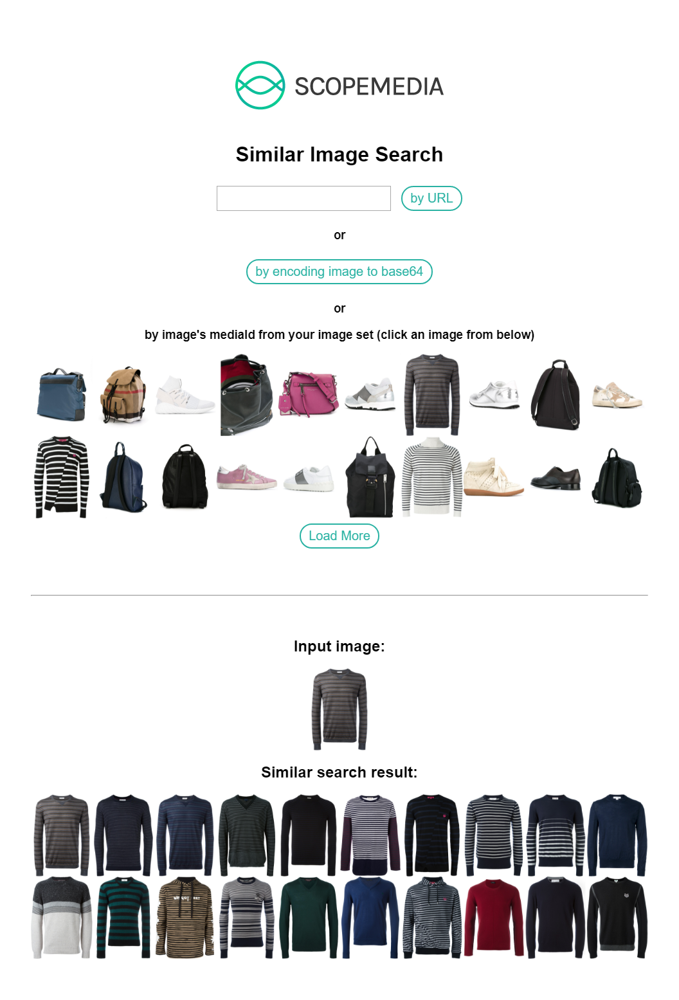

ScopeMedia JavaScript Demo - Similar Image Search
=====
A demo HTML page implementing [ScopeMedia JavaScript SDK](https://github.com/ScopeMediaInc/javascript-sdk).

Installation
-----
Clone or download this repository.

Usage
-----
Open **index.html** in any HTML5 browser. This project uses a demo account's image set, which has 200 fashion images. You can enter a URL, choose an image file, or select an image from current image set to search similar images in the image set. All actions and outputs are logged in developer console.

To use your image set, edit **index.html** and replace the values of clientId and clientSecret with your application credentials from [dashboard](https://api.scopemedia.com/#/dashboard/products/ScopeCheck/feature).

Links
-----
* [ScopeMedia JavaScript SDK](https://github.com/ScopeMediaInc/javascript-sdk)
* [ScopeMedia API](https://developer.scopemedia.com/documentation/)

Screenshot
-----

